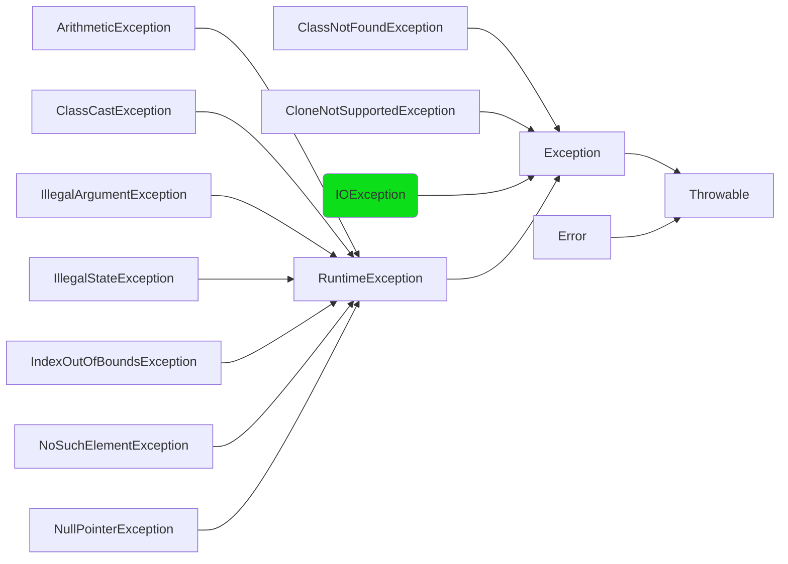
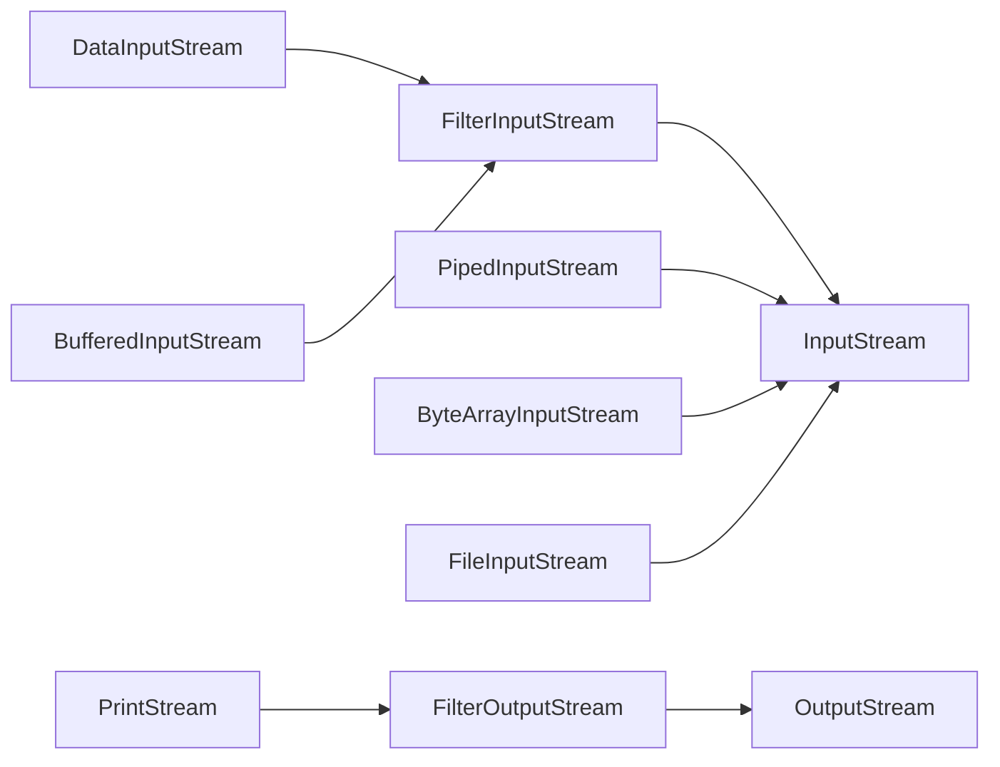
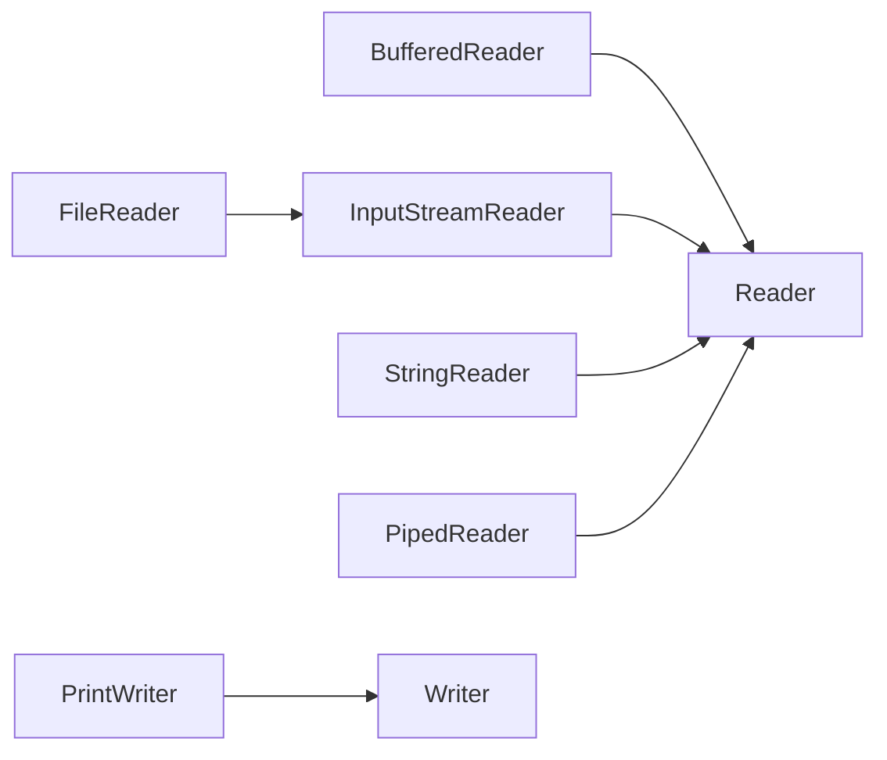

# 3 Exceptions & IO
## Exception

- Checked: Must be Caught or Declared to be Thrown(Green One)
- Unchecked: no such restrictions(code below compile just fine)



```java
public class Throwable implements Serializable{
	Throwable();
	Throwable(String message);//Constructs a new throwable with the specified detail message.
	String getMessage();//Returns the detail message string of this throwable
	String toString();//Returns a short description of this throwable.
	void printStackTrace();
	void printStackTrace(PrintStream s);
}
```

### The try-catch mechanism

The try-with-resources Statement

- The try-with-resources statement ensures that each resource is closed at the end of the statement
- The resource can be put here must implements AutoCloseable

```java
//FileReader and BufferedReader are resources
String readFirstLineFromFile(String path) throws IOException {
	try (FileReader fr = new FileReader(path);
			BufferedReader br = new BufferedReader(fr)) {
		return br.readLine();
	}
}	
```

When an exception is thrown, it descends the call stack.


In Java SE 7 and later, a single catch block can handle more than one type of exception. This feature can reduce code duplication and lessen the temptation to catch an overly broad exception.

```java
catch (IOException|SQLException ex) {
    logger.log(ex);
    throw ex;
}
```

### throw and throws

- You can claim to throw an Exception that you really don't
- *throws*: Anyone call your funcition must catch it or declare to throw this exception.

```java
throw new Exception("Help");//祈使句
public void f()throws SException,IOExption{}//陈述句三单
public void writeList() throws IOException{//IndexOutOfBoundsException is unchecked
    PrintWriter out = new PrintWriter(new FileWriter("OutFile.txt"));
    for (int i = 0; i < SIZE; i++) {
        out.println("Value at: " + i + " = " + list.get(i));
    }
    out.close();
}
```

### throw Inheritance

**成员函数:父类和接口的交集**

When you overide a method, you can only throw the exceptions that have beeen specified in the *base-class* version of the method.

反证: Polymorphism

```java
class A{
	void f()throws ExceptionA;
}
class B extends A{
	void f()throws ExceptionaA,ExceptionB;
}
void process(A p){
	try{
		p.f();//Compile过而Run Time error,throw B时A.f()会捕捉不到
	}catch(A a){

	}
}
process(new B())
```

**构造方法:父类的超集**

因为构造方法里隐含调用了 super(); address了父类可以再加自己的

```java
class BaseballException extends Exception{}
class Foul extends BaseballException{}
class Strike extends BaseballException{}

abstract class Inning{
	Inning() throws BaseballException{}
	abstract void atBat() throws Strike, Foul;
	void walk(){} 
}

class RainedOut extends Exception{}
class PopFoul extends Foul{}

interface Storm{
	void event()throws RainedOut;
}

public class StormInning extends Inning implements Storm{
	StormInning() throws RainedOut,BaseballException;
	StormInning(String s) throws Foul,BaseballException;
	void walk()throws PopFoul{}// Compile Error
	void atBat()throws PopFoul{} // call stack, ok
}
```
## IO
### Byte Streams



CopyBytes spends most of its time in a simple loop that reads the input stream and writes the output stream, one byte at a time. The best approach is to use character streams


**InputStream**

- read()
  - int read()
  - int read(byte b[])
  - int read(byte b[],int off,int len): Reads up to len bytes of data from the input stream into an array of bytes. The first byte would be stored into b[off]. 
- skip(long n)

**OutputStream**

- write()
  - write(int b)
  - write(byte b[]);
  - write(byte b[],int off,int len)
- flush(): Flushes this output stream and forces any buffered output bytes to be written out

### Character Streams

Reader、Writer Method同InputStream/OutputStream



Line-Oriented I/O

BufferedReader: String readLine()

```java
try(
	BufferedReader inputStream = new BufferedReader(new FileReader("xanadu.txt"));
	PrintWriter outputStream = new PrintWriter(new FileWriter("characteroutput.txt");
) {
	while ((String l = inputStream.readLine()) != null) {
		outputStream.println(l); // PrintWriter object autoflushes the buffer on every invocation of println or format.
	}
}
```

Character streams are often "wrappers" for byte streams 
- FileReader wraps FileInputStream, FileWriter wraps FileOutputStream
- Two general-purpose byte-to-character "bridge" streams: InputStreamReader and OutputStreamWriter

The Standard Streams(System.in, System.out, System.err) are byte streams

```java
//Transform Standard Input/Output into a character stream
BufferedReader br = new BufferedReader(new InputStreamReader(System.in));
BufferedWriter log = new BufferedWriter(new OutputStreamWriter(System.out));
```

### Java.nio

nio = new/Non-blocking IO

- using methods in java.io, threads will block while waiting for a stream or buffer.
- java.nio will not block
