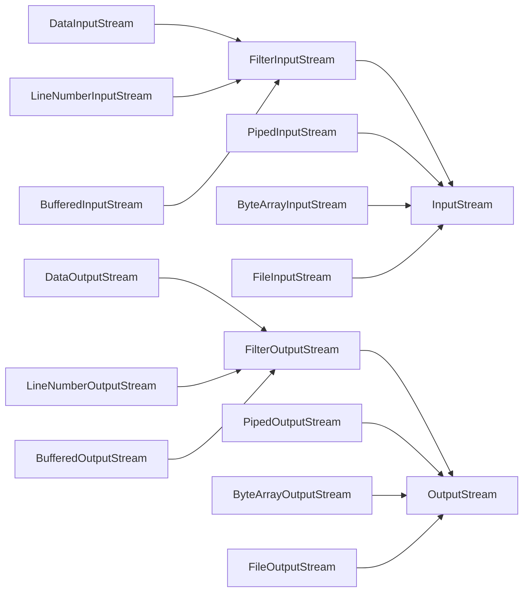
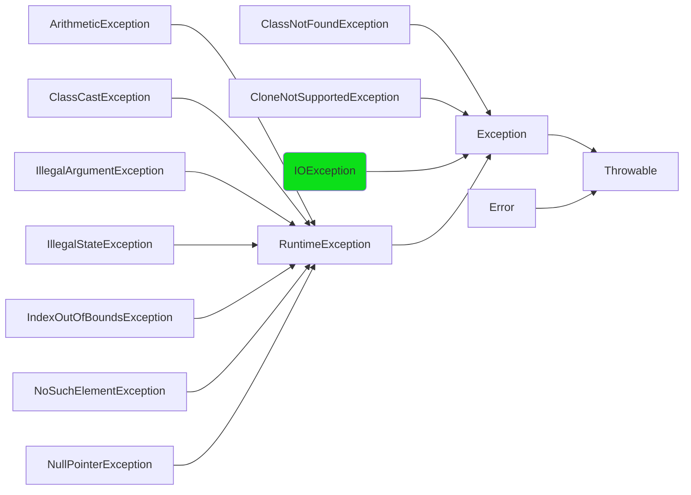

# Java Application Design--Exceptions & IO

## IO
### Read a file(Exception)

1. open the file;(共享文件同时正在写)
2. determine its size;
3. allocate that much memory;(JVM64MB)
4. read the file into memory;(杭州下雨软盘失效)
5. close the file;

### Stream



DataInputStream:二进制写的 primitive

LineNumberInputStream:一行行读文本

**InputStream**

- read()
  - int read()
  - read(byte b[])
  - read(byte b[],int off,int len)
- skip(long n)
- int available()
- mark()
- reset()
- boolean markSupported()
- close()

**OutputStream**

- write()
  - write(int b)
  - write(byte b[]);
  - write(byte b[],int off,int len)
- flush()
- close()

## Throwable

```java
public class Throwable implements Serializable{
	Throwable();
	Throwable(String message);//Constructs a new throwable with the specified detail message.
	String getMessage();//Returns the detail message string of this throwable
	String toString();//Returns a short description of this throwable.
	void printStackTrace();
	void printStackTrace(PrintStream s);
}
```

## Exception

- Checked: Must be Caught or Declared to be Thrown(Green One)
- Unchecked: no such restrictions(code below compile just fine)



### The catch mechanism

When an exception is thrown, it descends the call stack.


### throw and throws

You can _claim_ to throw an Exception that you really don't.

1. Otherwise if you 在 f()内 throw 别的异常编译不通过.

2. Anyone call your funcition must catch it or throws again.

```java
throw new Exception("Help");//祈使句
class SException extends Exception{}//陈述句三单
public void f()throws SException,IOExption{}//陈述句三单
```

### throw Inheritance

**成员函数:父类和接口的交集**

When you overide a method, you can only throw the exceptions that have beeen specified in the *base-class* version of the method.

反证: Polymorphism

```java
class A {
	void f()throws A;
}
class B{
	void f()throws A,B;
}
void process(A p){
	try{
		p.f();//Compile过而Run Time error,throw B时A.f()会捕捉不到
	}catch(A a){

	}
}
process(new B())
```

**构造方法:父类的超集**

因为构造方法里隐含调用了 super(); address了父类可以再加自己的

```java
class BaseballException extends Exception{}
class Foul extends BaseballException{}
class Strike extends BaseballException{}

abstract class Inning{
	Inning() throws BaseballException{}
	abstract void atBat() throws Strike, Foul;
	void walk(){} 
}

class RainedOut extends Exception{}
class PopFoul extends Foul{}

interface Storm{
	void event()throws RainedOut;
}

public class StormInning extends Inning implements Storm{
	StormInning() throws RainedOut,BaseballException;
	StormInning(String s) throws Foul,BaseballException;
	void walk()throws PopFoul{}// Compile Error
	void atBat()throws PopFoul{} // call stack, ok
}
```
