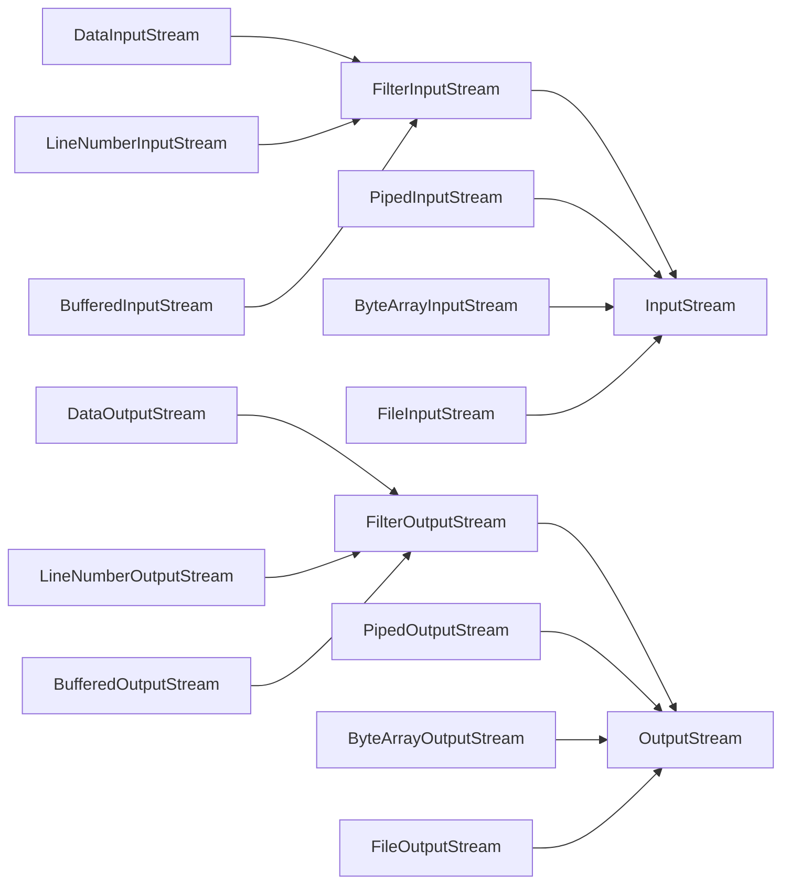
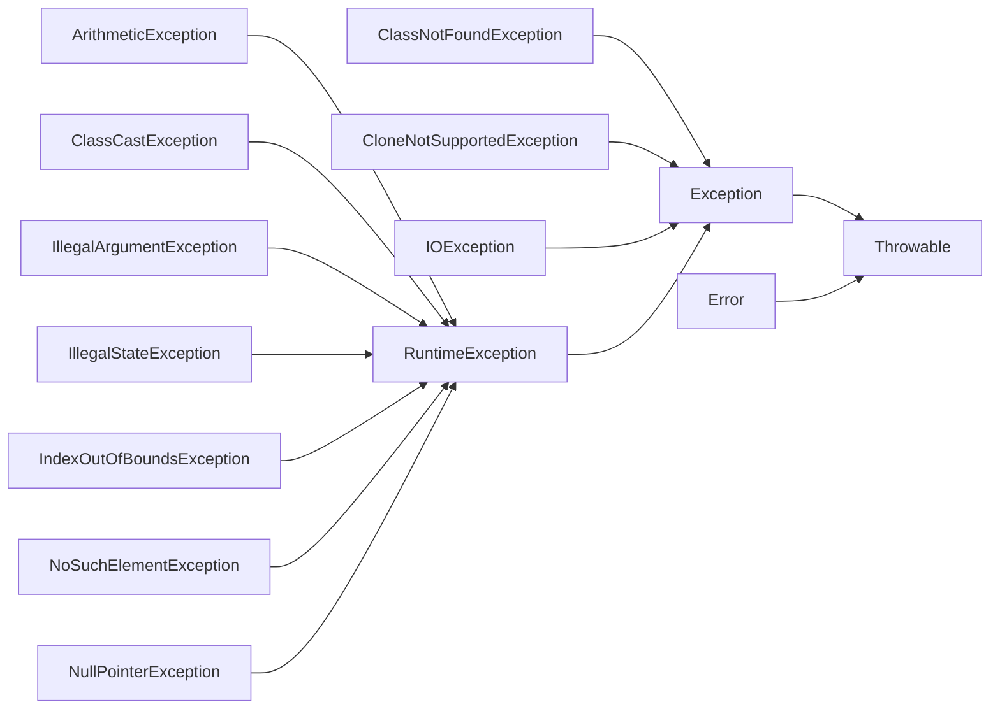

# Java Application Design--Exceptions & IO

## IO
### Read a file
1. open the file;(共享文件同时正在写)
2. determine its size;(文件=键盘)
3. allocate that much memory;(JVM64MB)
4. read the file into memory;(杭州下雨软盘失效)
5. close the file;

### Stream



DataInputStream:二进制写的primitive

LineNumberInputStream:一行行读文本
**InputStream**

- read()
	- int read()
	- read(byte b[])
	- read(byte b[],int off,int len)
- skip(long n)
- int available()
- mark()
- reset()
- boolean markSupported()
- close()

**OutputStream**
- write()
	- write(int b)
	- write(byte b[]);
	- write(byte b[],int off,int len)
- flush()
- close()

## Exceptions

### The catch mechanism

**throw try to match a catch**


### throw and throws

You can *claim* to throw an Exception that you really don't.

1. Otherwise if you 在f()内throw别的异常 编译不通过.

2. Anyone call your funcition must catch it or throws again.
```java
throw new Exception;//祈使句
class SException extends Exception{}//陈述句三单
public void f()throws SException,IOExption{}//陈述句三单
```

### Interface:throwable



- String get Message();
- String toString();
- void printStackTrace();
- void printStackTrace(PrintStream);

### throw Inheritance

**成员函数:父类和接口的交集**
```java
class B extends A;
A b=new B();
b.f();//编译器认为他还是A类，如果throw其他异常会光A.f()捕捉不到
```
**构造方法:父类的超集**

因为构造方法里隐含调用了super();

