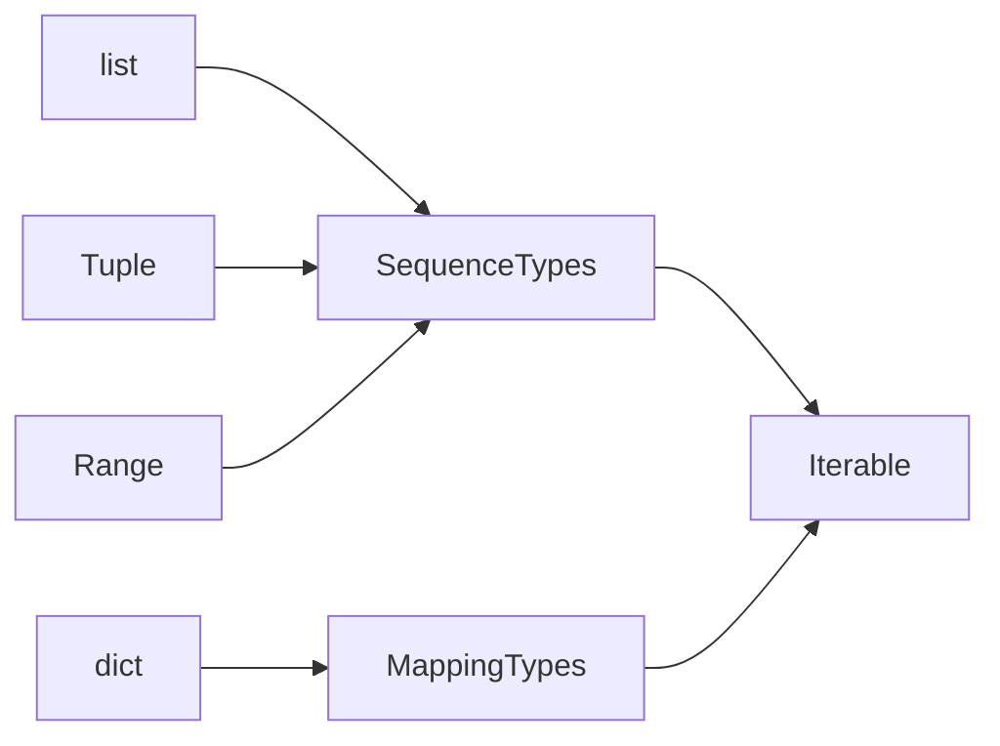

# 1 Python Basic
## Functions
- functions without a return statement return None
- default value: The default value is evaluated only once, unless it is a mutable object such as a list, dictionary, or instances of most classes
- keyword arguments must follow positional arguments
```python
## General
i = 5
def f(arg=i):
    print(arg)

i = 6
f() # 5

## Mutable object
def f(a, L=[]):
    L.append(a)
    return L

print(f(1)) # [1]
print(f(2)) # [1,2]
print(f(3)) # [1,2,3]

# positional: *name, keyword: **name
def cheeseshop(kind, *arguments, **keywords):
    # arguments receives a tuple, keywords receives a dictionary
    print("-- Do you have any", kind, "?")
    for arg in arguments:
        print(arg)
    for kw in keywords:
        print(kw, ":", keywords[kw])
```

### Unpacking argument lists

```python
nums = [3, 6]
list(range(*nums)) # * to unpack the arguments out of a list or tuple->[3, 4, 5]
d = {"voltage": "four million", "state": "bleedin' demised", "action": "VOOM"}
parrot(**d) # ** deliver keyword arguments
```

### lambda

lambda parameter_list : expression

### Function Annotations

```python
def input(__prompt: object = "") -> str: ...
```
## Iterable

Any classes you define with an &#095;iter&#095;() method or with a &#095;getitem&#095;() method that implements sequence semantics are Iterable



### Common Sequence Operations

s and t are sequences of the same type, n, i, j and k are integers and x is an arbitrary object that meets any type and value restrictions imposed by s

|Operation|Notes|
|-|-|
|x in s||
|x not in s||
|s + t|concatenation, range excluded|
|s &#042; n or n &#042; s|repeat *reference*, range excluded|
|s&#091;i&#093;|index|
|s&#091;i:j:k&#093;|slice of s from i to j with step k|
|len(s)|The argument may be a sequence (such as a string, bytes, tuple, list, or range) or a collection (such as a dictionary, set, or frozen set).|
|min(s)/max(s)||
|s.count(x)||


```python
lists = [[2]] * 3
lists[0].append(3)
print(lists) # [[2, 3], [2, 3], [2, 3]]
```

### Immutable Sequence Types

support hash()

### Mutable Sequence Types

|Operation|Notes|
|-|-|
|s&#091;i&#093; = x||
|s&#091;i:j:k&#093; = t||
|s.append(x)||
|s.copy()|creates a shallow copy of s|
|s.extend(t) / s += t||
|s *= n||
|s.insert(i, x)||
|s.pop() or s.pop(i)|retrieves the item at i and also removes it from s|
|s.remove(x)||
|s.reverse()||

## Data Types
### Numbers

- Division (/) always returns a float. To do floor division and get an integer result you can use the // operator
- use the ** operator to calculate powers

### Strings

str is immutable, but it implement all of the common sequence operations

Two ways of formating

```python
print(f'The value of pi is approximately {math.pi:1.3f}.')
print('The value of pi is approximately {:1.3f}'.format(math.pi))
# positional and keyword arguments
print('The story of {0}, {1}, and {other}.'.format('Bill', 'Manfred',other='Georg'))
table = {'Sjoerd': 4127, 'Jack': 4098, 'Dcab': 8637678}
print('Jack: {Jack:d}; Sjoerd: {Sjoerd:d}; Dcab: {Dcab:d}'.format(**table)) # Jack: 4098; Sjoerd: 4127; Dcab: 8637678
```
### List

List is mutable

More: 

list.sort(*, key=None, reverse=False)

```python
lst = [('Ann','20','400'), ('Scott','40','500'), ('Bean','10','450')]
lst.sort(key=lambda x:x[1])

# use cmp_to_key
from functools import cmp_to_key
lists = [1,23,2,134,51,213,12,33]
lists.sort(key=cmp_to_key(lambda x,y:x-y))
```

### Tuple

tuple is immutable

Tuples may be constructed in a number of ways:

- Using a pair of parentheses to denote the empty tuple: ()
- Using a trailing comma for a singleton tuple: a, or (a,)
- Separating items with commas: a, b, c or (a, b, c)
- Using the tuple() built-in: tuple() or tuple(iterable)

### Range

range is immutable

