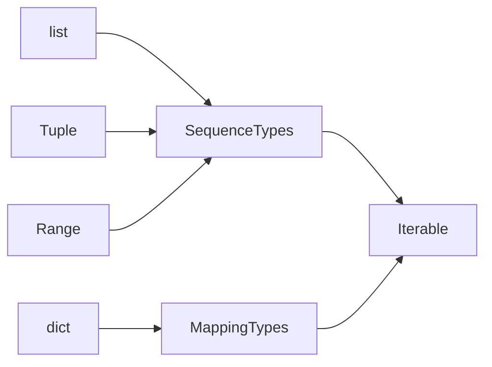

# 1 Python Basic
## Functions
- functions without a return statement return None
- default value: The default value is evaluated only once, unless it is a mutable object such as a list, dictionary, or instances of most classes
- keyword arguments must follow positional arguments
```python
## General
i = 5
def f(arg=i):
    print(arg)

i = 6
f() # 5

## Mutable object
def f(a, L=[]):
    L.append(a)
    return L

print(f(1)) # [1]
print(f(2)) # [1,2]
print(f(3)) # [1,2,3]

# positional: *name, keyword: **name
def cheeseshop(kind, *arguments, **keywords):
    # arguments receives a tuple, keywords receives a dictionary
    print("-- Do you have any", kind, "?")
    for arg in arguments:
        print(arg)
    for kw in keywords:
        print(kw, ":", keywords[kw])
```
### Scope

Python has only function scope, no block scope
```python
if a > 3:
    choice = "pears"
print(choice) # pears
```

local vs global variable

only read from global variable, never modify it

```python
choice = "zombie"
def choose_menu():
    # choice += "!" 
    # UnboundLocalError: local variable 'choice' referenced before assignment
    return choice + "!"

choice  = choose_menu()
print(choice) # zombie!
```

### Unpacking argument lists

```python
nums = [3, 6]
list(range(*nums)) # * to unpack the arguments out of a list or tuple->[3, 4, 5]
d = {"voltage": "four million", "state": "bleedin' demised", "action": "VOOM"}
parrot(**d) # ** deliver keyword arguments
```

### lambda

lambda parameter_list : expression

### Function Annotations

```python
def input(__prompt: object = "") -> str: ...
```
## Class
### Constructor

python allow only one constructor but multiple inheritance

```python
class Complex(Base1,Base2,Base3): # Inheritance
    def __init__(self, realpart, imagpart):
        self.r = realpart
        self.i = imagpart
```

### Class and instance variables

```python
class Dog:

    kind = 'canine'         # class variable shared by all instances
    def __init__(self, name):
        self.name = name    # instance variable unique to each instance

d = Dog('Fido')
e = Dog('Buddy')
print(d.kind)                  # 'canine'
print(e.kind)                  # 'canine'
print(d.name)                  # 'Fido'
print(e.name)                  # 'Buddy'
```

### Class and Static Method

A class method can access or modify the class state while a static method can’t access or modify it. They both bound to the class and not the object of the class.

```python
class C(object):
    @classmethod
    def fun(cls, arg1, arg2, ...):
    @staticmethod
    def func(arg1, arg2, ...):
```

## Packages

```python
# absolute imports
import sound.effects.echo
sound.effects.echo.echofilter(input, output, delay=0.7, atten=4)
# relative imports
from .subpackage1.module5 import function2
from ..filters import equalizer
# naming imports
from sound.effects import echo
echo.echofilter(input, output, delay=0.7, atten=4)
```

## Iterable

Any classes you define with an &#095;&#095;iter&#095;&#095;() method or with a &#095;&#095;getitem&#095;&#095;() method that implements sequence semantics are Iterable



the *for* statement calls &#095;&#095;iter()&#095;&#095; on the container object.

&#095;&#095;iter()&#095;&#095;returns an iterator object that defines the method &#095;&#095;next&#095;&#095;() which accesses elements in the container one at a time. When there are no more elements, &#095;&#095;next&#095;&#095;() raises a StopIteration exception which tells the for loop to terminate.

### Generators

Generators are a simple and powerful tool for creating iterators. However, unlike lists, iterator object generated by Generator does not store their contents in memory. 

yield: Each time next() is called on it, the generator resumes where it left off (it remembers all the data values and which statement was last executed).

```python
## Tradition
def csv_reader(file_name):
    file = open(file_name)
    result = file.read().split("\n")
    return result

## Generators
def csv_reader(file_name):
    for row in open(file_name, "r"):
        yield row
## Generator expression
# csv_gen = row for row in open("some_csv.txt","r")

csv_gen = csv_reader("some_csv.txt")
```

### Common Sequence Operations

s and t are sequences of the same type, n, i, j and k are integers and x is an arbitrary object that meets any type and value restrictions imposed by s

|Operation|Notes|
|-|-|
|x in s||
|x not in s||
|s + t|concatenation, range excluded|
|s &#042; n or n &#042; s|repeat *reference*, range excluded|
|s&#091;i&#093;|index|
|s&#091;i:j:k&#093;|slice of s from i to j with step k|
|len(s)|The argument may be a sequence (such as a string, bytes, tuple, list, or range) or a collection (such as a dictionary, set, or frozen set).|
|min(s)/max(s)||
|s.count(x)||


```python
lists = [[2]] * 3
lists[0].append(3)
print(lists) # [[2, 3], [2, 3], [2, 3]]
```

### Immutable Sequence Types

support hash()

### Mutable Sequence Types

|Operation|Notes|
|-|-|
|s&#091;i&#093; = x||
|s&#091;i:j:k&#093; = t||
|s.append(x)||
|s.copy()|creates a shallow copy of s|
|s.extend(t) / s += t||
|s *= n||
|s.insert(i, x)||
|s.pop() or s.pop(i)|retrieves the item at i and also removes it from s|
|s.remove(x)||
|s.reverse()||

## Data Types
### Numbers

- Division (/) always returns a float. To do floor division and get an integer result you can use the // operator
- use the ** operator to calculate powers

### Strings

str is immutable, but it implement all of the common sequence operations

Two ways of formating

```python
print(f'The value of pi is approximately {math.pi:1.3f}.')
print('The value of pi is approximately {:1.3f}'.format(math.pi))
# positional and keyword arguments
print('The story of {0}, {1}, and {other}.'.format('Bill', 'Manfred',other='Georg'))
table = {'Sjoerd': 4127, 'Jack': 4098, 'Dcab': 8637678}
print('Jack: {Jack:d}; Sjoerd: {Sjoerd:d}; Dcab: {Dcab:d}'.format(**table)) # Jack: 4098; Sjoerd: 4127; Dcab: 8637678
```
### List

List is mutable

More: 

```python
# check empty
a = []
if a:
    print("List has elements")
else:
    print("List is empty!")
```

list.sort(*, key=None, reverse=False)

```python
lst = [('Ann','20','400'), ('Scott','40','500'), ('Bean','10','450')]
lst.sort(key=lambda x:x[1])

# use cmp_to_key
from functools import cmp_to_key
lists = [1,23,2,134,51,213,12,33]
lists.sort(key=cmp_to_key(lambda x,y:x-y))
```

### Tuple

tuple is immutable

Tuples may be constructed in a number of ways:

- Using a pair of parentheses to denote the empty tuple: ()
- Using a trailing comma for a singleton tuple: a, or (a,)
- Separating items with commas: a, b, c or (a, b, c)
- Using the tuple() built-in: tuple() or tuple(iterable)

### Range

range is immutable

### dict

dict is mutable

```python
a = dict(one=1, two=2, three=3)
b = {'one': 1, 'two': 2, 'three': 3}
c = dict(zip(['one', 'two', 'three'], [1, 2, 3]))
d = dict([('two', 2), ('one', 1), ('three', 3)])
e = dict({'three': 3, 'one': 1, 'two': 2})
f = dict({'one': 1, 'three': 3}, two=2)
print(a == b == c == d == e == f) # true
```

## Control Flow and Loops

```python
## ifelse
if x < y:
    print("x is less than y")
elif x > y:
    print("x is greater than y")
else:
    print("x is equal to y")
## Switch
# Only the first pattern that matches gets executed
match status:
    case 400:
        return "Bad request"
    case 401| 403 |404:
        return "Not allowed"
    case 404:
        return "Not found"
    case 418:
        return "I'm a teapot"
    case _:
        return "Something's wrong with the internet"
```

Chaining comparison

- def all(__iterable: Iterable[object]) -> bool
- def any(__iterable: Iterable[object]) -> bool

```python
# Double comparison
if 0< i < 10: ...
# Multiple comparison
if all([a>10, i<1, y>20]): ...
```

## Exceptions

```python
try:
    result = x / y
except ZeroDivisionError:
    print("division by zero!")
finally:
    print("executing finally clause")
```