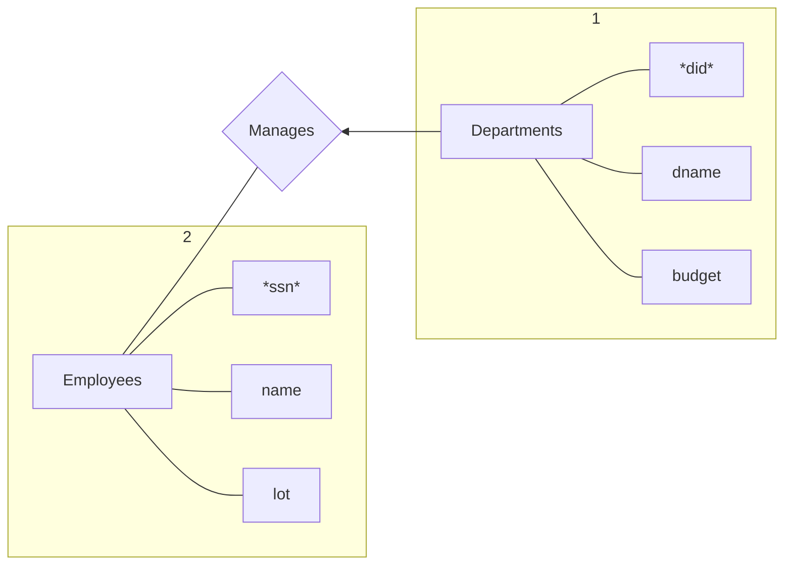
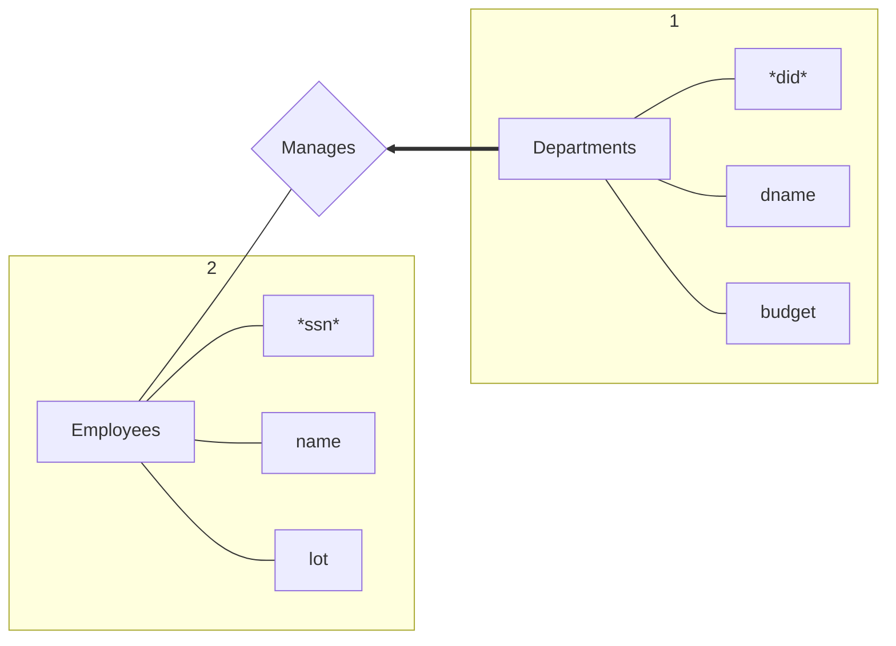

# CS186 Lecture2 --Data Models

Logical data independence: Maintain views when logical structure changes

Phisical data independence: Maintain logical structure when phisical structure changes


# ER Model
## Key constraints

arrow: 可以divided(从尾到头at most one)


```sql
create table manages(
  ssn char(11),
  did integer,
  primary key (did),
  foreign key (ssn) references Employees,
  foreign key (did) references Departments
)
```
## Participation constraints
粗线: Total participation(从尾到头at least one)

故以下从尾到头exactly one


```sql
create table manages(
  did integer,
  dname char(20),
  budget real,
  ssn char(11) not null,
  primary key(did),
  foreign key (ssn) references Employees on delete no action
)
```
## Weak Entity Set

An entity set that does not have a primary key


```sql
create table Dep_Policy(
  pname char(20),
  age integer,
  cost real,
  ssn char(11) not null,
  primary key (pname,ssn),
  foreign key (ssn) references employees on delete cascade
)
```

# Functional Dependencies

## Definition

Let $R$ be a relation scheme

let $X \subseteq R$ and $Y \subseteq R$. 

We say that a relation instance $r(R)$ satisfies a functional dependency $X \rightarrow Y$ if
for every pair of tuples $t1 \in r$ and $t2 \in r$, if $t1[X] = t2[X]$ then $t1[Y] = t2[Y]$.


## ArmStrong's Axioms

Reflexivity: If $X \supseteq Y$, then $X \rightarrow Y$(*trivial FD*)

Augmentation: If $X \rightarrow Y$, then $XZ \rightarrow YZ$ for any Z.

Transitivity: If $X \rightarrow Y$ and $Y \rightarrow Z$, then $X \rightarrow Z$

Union: If $X \rightarrow Y$ and $X \rightarrow Z$, then $X \rightarrow YZ$

Decomposition: If $X \rightarrow YZ$, then $X \rightarrow Y$ and $X \rightarrow Z$

## Keys

- A superkey is a set of attributes $A_1, ..., A_n$ s.t. 

  for any other attribute B, we have $A_1, ..., A_n \rightarrow B$

- A candidate key (or sometimes just key) is a 
minimal superkey