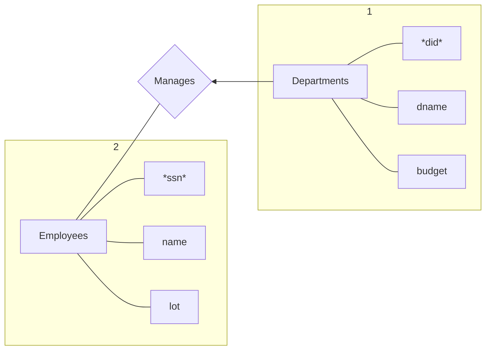
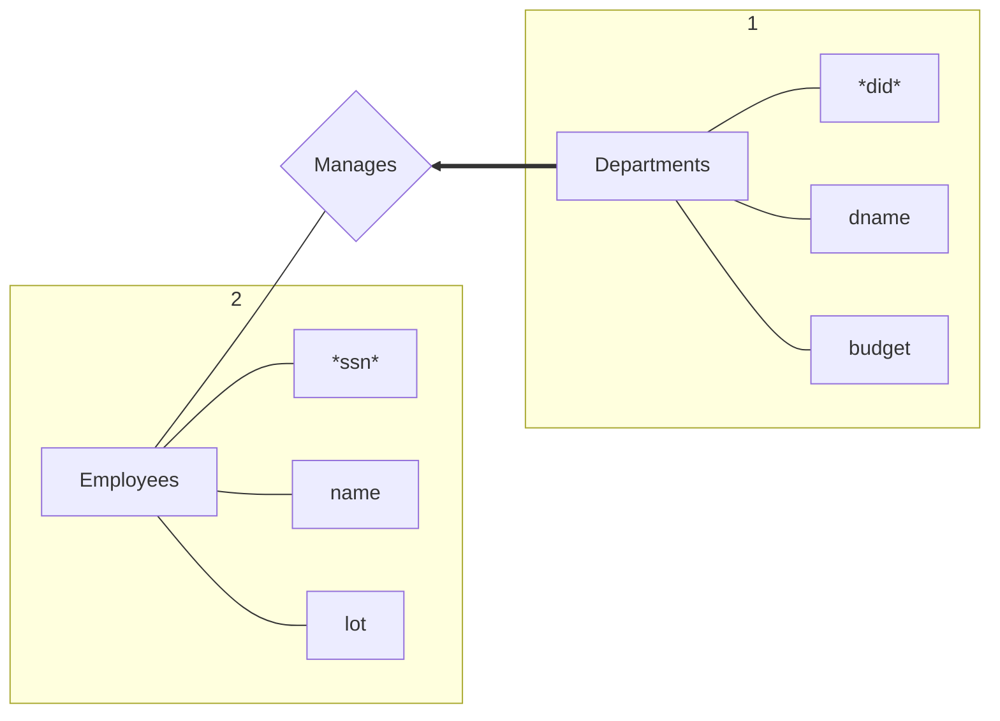

# Data Models

Logical data independence: Maintain views when logical structure changes

Phisical data independence: Maintain logical structure when phisical structure changes


# ER Model
## Key constraints

arrow: 可以divided(从尾到头at most one)


```sql
create table manages(
  ssn char(11),
  did integer,
  primary key (did),
  foreign key (ssn) references Employees,
  foreign key (did) references Departments
)
```
## Participation constraints
粗线: Total participation(从尾到头at least one)

故以下从尾到头exactly one


```sql
create table manages(
  did integer,
  dname char(20),
  budget real,
  ssn char(11) not null,
  primary key(did),
  foreign key (ssn) references Employees on delete no action
)
```
## Weak Entity Set

An entity set that does not have a primary key


```sql
create table Dep_Policy(
  pname char(20),
  age integer,
  cost real,
  ssn char(11) not null,
  primary key (pname,ssn),
  foreign key (ssn) references employees on delete cascade
)
```